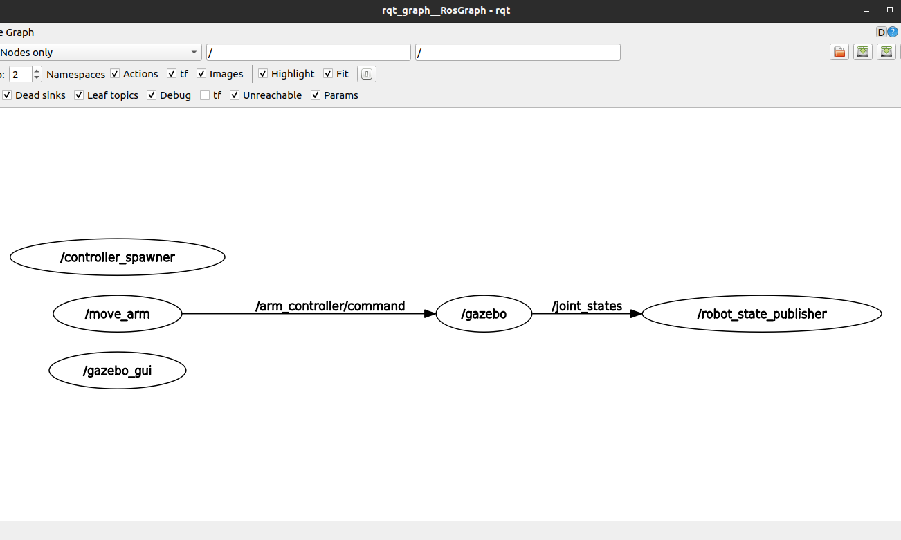
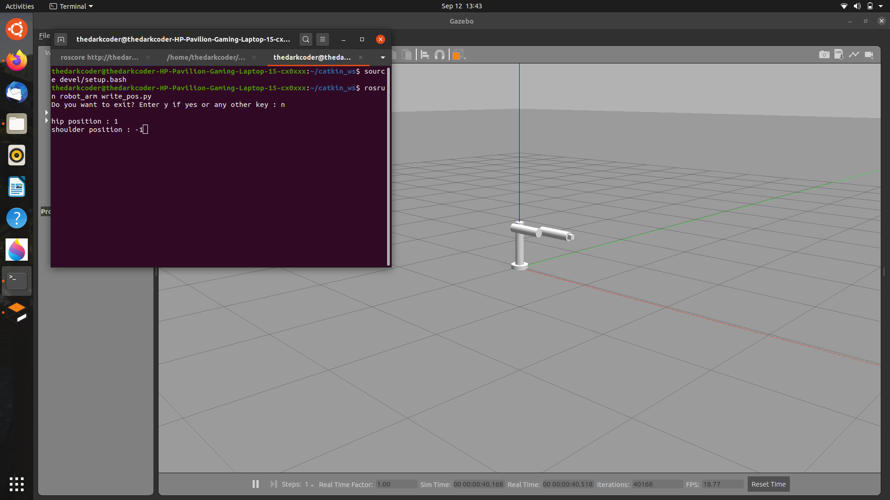
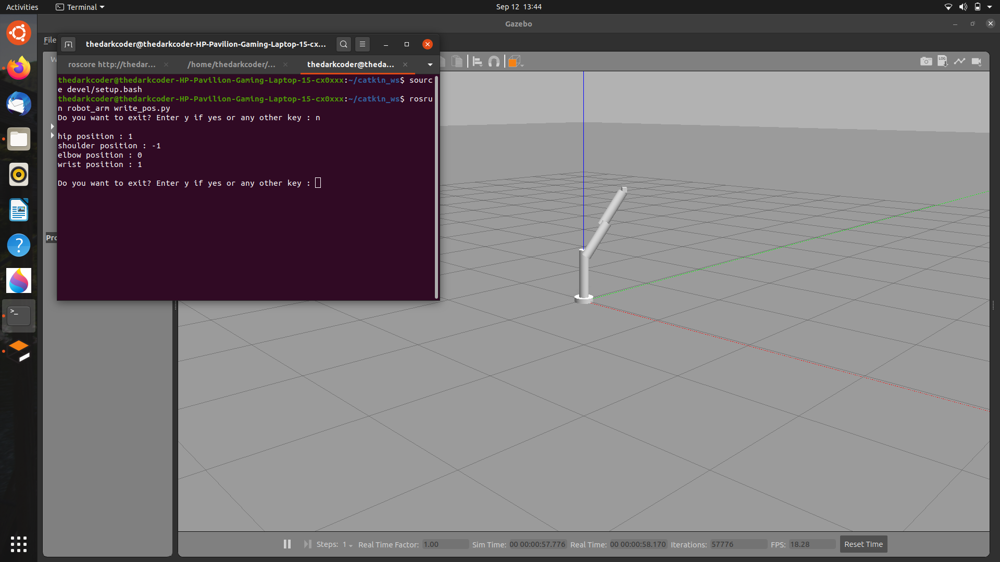
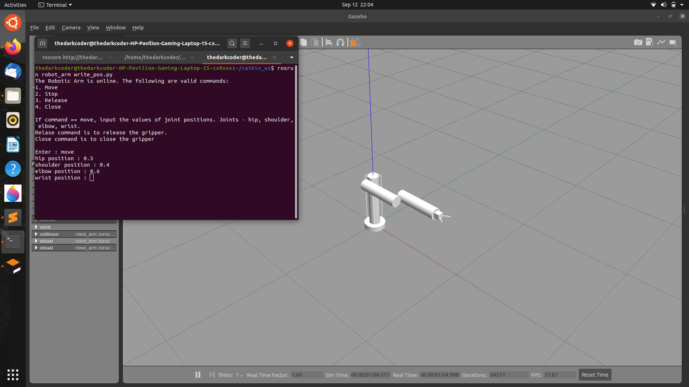
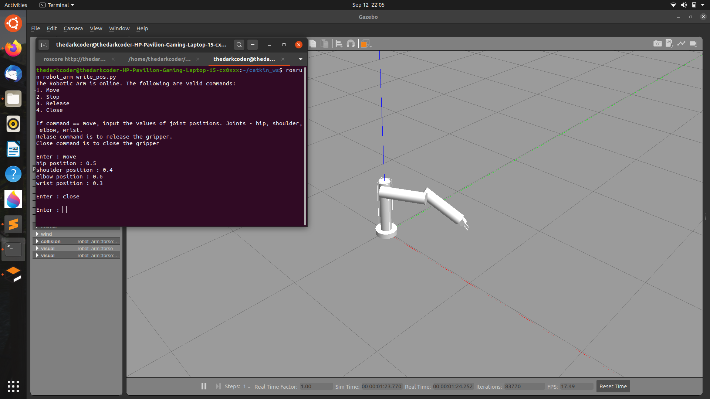

# Robotic_Arm_Simulation_in_ROS

## About
This a simulation of a 4-DOF robotic arm in gazebo, using ROS. This follows the simple architecture of a traditional industrial arm, with a base link, torso, upper arm, lower arm and hand. The position of the joints are entered by running the move_arm node write_pos.py program in another terminal. This arm is designed without using meshes, hence has very basic geometrical structure. The model is spawned in gazebo.

## Design
The bot is designed by using a urdf (Unified Robotic Description Format) which is an XML file format. The links about the robots are specified in the urdf file. They are: 
1. base_link: The base of the arm which is fixed to the gazebo world.
2. torso: Connected to base_link. Connected by a continuous joint.
3. upper_arm: Connected to torso. Connected by a revolute joint for restricted motion.
4. lower_arm: This is connected to upper_arm by a revolute joint.
5. hand: Connected to lower_arm by a continuous jiont.

The joints which are connecting the various links are:
(joint: child_link to parent_link)

1. fixed: base_link to world
2. hip: torso to base_link
3. shoulder: upper_arm to base_link
4. elbow: lower_arm to upper_arm
5. wrist: hand to lower_arm

The motion of these joints are enabled by transmissions and the gazebo plugins.

## Publishing messages
The motion planning of the arm is done by publishing messages to the `/arm_controller/command` topic in ROS. The message type this topic takes if of type `trajectory_msgs/JointTrajectory`
The messages type of the above msg file are:
~~~~
std_msgs/Header header
  uint32 seq
  time stamp
  string frame_id
string[] joint_names
trajectory_msgs/JointTrajectoryPoint[] points
  float64[] positions
  float64[] velocities
  float64[] accelerations
  float64[] effort
  duration time_from_start
  ~~~~
  
To move the arm we are changing the position values of the `positions` list on the `JointTrajectoryPoint`, which is subsribed by gazebo node (as seen in the rqt_graph in the section below) The gazebo node takes these values and are published to `/joint_states` topic, which is subscribed by the `robot_state_publisher` node(again, refer rqt_graph) which then maps it to gazebo ui and RoboHW.
This is a brief overview of how the arm is moveing on inputting the desired position inputs.

## Images

### RQT Graph

### Initial pose (before entering positions)

### Final pose (after entering positions)

### Update: After adding gripper

## References
I have referred the book **'Programming Robots with ROS'** for modelling the arm.

## Version
This is version 1.0. We are planning several updates and they will be uploaded here.
**Update:**
- Added gripper to the urdf model. Version 1.0.1
- Modified python script to control node. Version 1.1
- Increased range of shoulder joint.
- Added functionality to change only position of one joint. Version 1.1.1

## Note
If cloning the repository, clone it in your catkin_ws/src folder and run catkin_make command.

## How to run
After running catkin_make. Open a terminal. Run `roscore`.

Open a new tab in terminal.
1. Move in the catkin_ws directory using `cd catkin_ws`.
2. Once there type the following command in terminal - `source devel/setup.bash`.
3. Now type, `roslaunch robot_arm bot.launch`, to launch gazebo.

Open another tab in terminal. Repeat steps 1 and 2 from above paragraph. Now run, `rosrun robot_arm write_pos.py`, to perform actions on the arm.
